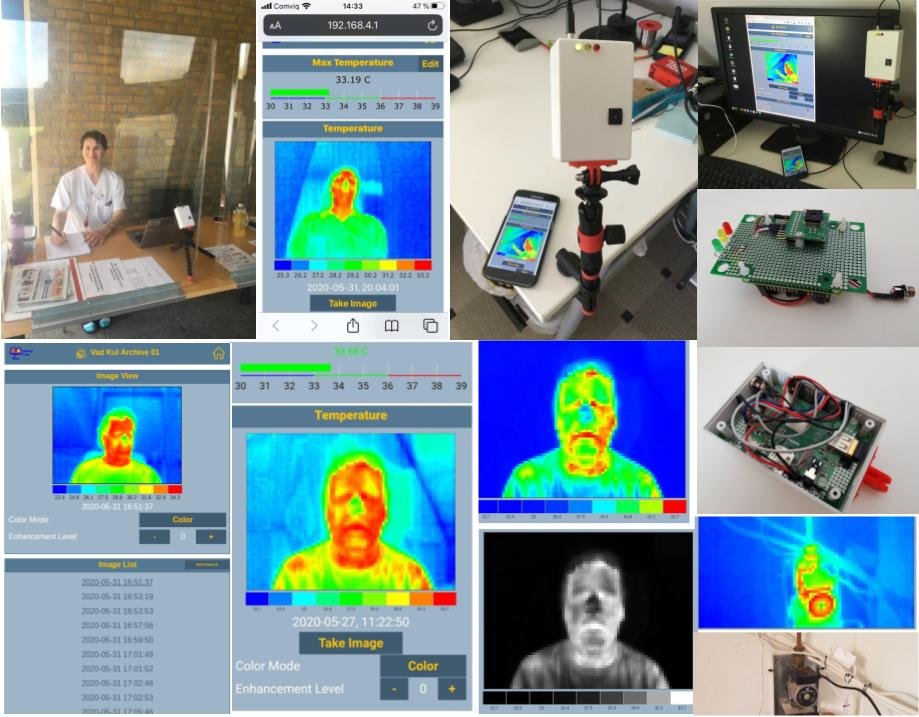

# Vad Kul Thermal Imager
  

The Vad Kul Thermal Imager is an open-source and inexpensive 80x60 pixel thermal camera that is that is is controlled and viewed via a web application. The camera also comes with MQTT hooks so that it can be viewed, controlled, and images archived over the internet. The camera is based on a Raspberry Pi connected to a FLIR LEPTON 2.5 thermal imager via a LEPTON 2.0 breakout board.
## Parts
- [Raspberry Pi 3A+ (or equivalent) (26 euros)](https://www.electrokit.com/en/product/raspberry-pi-3-model-a/)
- [8 GB or more microSD card (8.6 euros)](https://www.electrokit.com/en/product/memory-card-microsdhc-16gb/)
- [Case for Raspberry Pi (7.9 euros)](https://www.electrokit.com/en/product/pibow-coupe-ninja-lada-for-raspberry-pi-3a/)
- [Power supply 5V micro-USB (11.8 euros)](https://www.electrokit.com/en/product/power-supply-5v-3-1a-micro-usb/)
- [Mount for camera (3.9 euros)](https://www.electrokit.com/en/product/raspberry-pi-camera-mount/)
- [FLIR LEPTON 2.5 Thermal Image Sensor (146 euros)](http://d.digikey.com/VSXn03I7o90K000SN5tF8p0)
- [FLIR LEPTON BREAKOUT BOARD V2 (55 euros)](http://d.digikey.com/G9X0Ko00So59S07N00I3Fpt)
- [Jumper wires 1-pin female-female 150mm 10-pack (2.3 euros)](https://www.electrokit.com/en/product/jumper-wires-1-pin-female-female-150mm-10-pack/)
- [Edimax EW7811UN Wireless USB Adapter (9.5 euros)](https://www.proshop.se/Naetverkskort-adaptrar-osv/Edimax-EW7811UN-Wireless-USB-Adapter/2226476)

The part cost before tax is about 270 euros

## Connections

|LEPTON 2.0 Breakout - J2|Rasberry PI GPIO |
|---|---|
|P07 - SPI-CLK|P23 - GPIO 11|
|P09 - SPI-MOSI|P09 - GND|
|P10 - SPI-CS|P26 -GPIO 7|
|P12 - SPI-MISO|P21 - GPIO 9|
|P17 - RESET|P7 - GPIO 4|

|LEPTON 2.0 Breakout - J3|Rasberry PI GPIO |
|---|---|
|P01 - GND|P06 - GND|
|P02 - Vin|P02 - 5V|

## Raspberry Pi setup with pre-loaded disk image.
- [Download](https://www.need.to.add.com) and burn Raspbian image with Vad Kul already installed.
- When powered up, the Raspberry Pi will run Vad Kul automatically and the Raspberry Pi will act as a wireless hotspot. You can see the SSID of the hotspot is *vad-kul-01* and the password is *xxxx*
- Once connected to the Raspberry Pi hotspot navigate your browser to http://192.168.4.1 to see the application
- The Raspberry Pi will also act as a web server on Port 80

## Manual Raspberry Pi Setup
- Download and burn Raspbian image on SD card.
- If desired, make the Raspberry Pi a wireless hotspot following this [link](https://www.raspberrypi.org/documentation/configuration/wireless/access-point-routed.md). Note this will only work for Buster and later
- Enable SPI interfaces using `sudo raspi-config`
- Install Node.js on the Raspberry pi by following this [link](https://www.instructables.com/id/Install-Nodejs-and-Npm-on-Raspberry-Pi/)
- Install pm2 globally if desired for running in [background](https://nodered.org/docs/faq/starting-node-red-on-boot) and at startup by `sudo npm install -g pm2`
- In the /home/pi directory of the Raspberry Pi clone this repository
- Enter the project directory and `npm install` the node imports
- **IMPORTANT** - From the project directory, navigate to the sub-directory **flirLepton25capture** and type `make`
- create a file .env in the project directory and add the following lines  
`PROJECT=blinky-lite`  
`MQTTCLIENTID=vad-kul-tray-01`  
`MQTTSERVERIP=`*your-MQTT-broker-URL*  
`MQTTUSERNAME=`*your-MQTT-broker-username*  
`MQTTPASSWORD=`*your-MQTT-broker-password*
`JWTKEYSECRET=`*some-random-string-you-pick*  
`SETTINGSPASSWORD=`*your-choice*  
`NODEREDCONFIGSECRET=`*another-choice*    
- To run the code from the project directory enter `./run-blinky-lite.sh $(pwd)`
- OR to run the code in background enter from the project directory `./pm2.sh $(pwd)`
 - The Raspberry Pi now becomes a web server and you can see the application by pointing a web browser at the raspberry Pi at port 1883  
